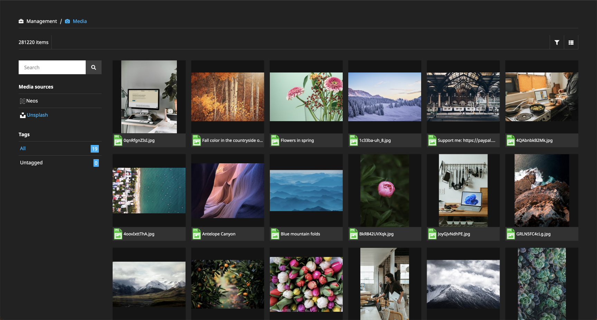

[](https://packagist.org/packages/dl/assetsource-unsplash) [](https://packagist.org/packages/dl/assetsource-unsplash) [](https://packagist.org/packages/dl/assetsource-unsplash)

# Unsplash Asset Source

## Installation

Install the package via composer

```bash
composer require dl/assetsource-unsplash
```
## How to use it

1. Read the [Unsplash API guidelines](https://help.unsplash.com/en/articles/2511245-unsplash-api-guidelines) carefully!
2. Register on [https://unsplash.com/developers](https://unsplash.com/developers) and get your Access key.
3. Configure the Access key in the settings:

```yaml
Neos:
 Media:
  assetSources:
    unsplash:
     assetSourceOptions:
       accessKey: your-access-key
```

Please take care of the correct attribution of used photos in the frontend. 



## Configuration

Since Neos 4.2 a copyright notice is automatically generated and stored with the asset. The copyright notice
template can be adjusted using the `copyRightNoticeTemplate` configuration value.

The following data can be used:
    
* user.id
* user.updated_at
* user.username
* user.name
* user.first_name
* user.last_name
* user.twitter_username
* user.portfolio_url
* user.bio
* user.location
* user.links
* user.profile_image
* user.instagram_username
* user.total_collections
* user.total_likes
* user.total_photos
* user.accepted_tos

